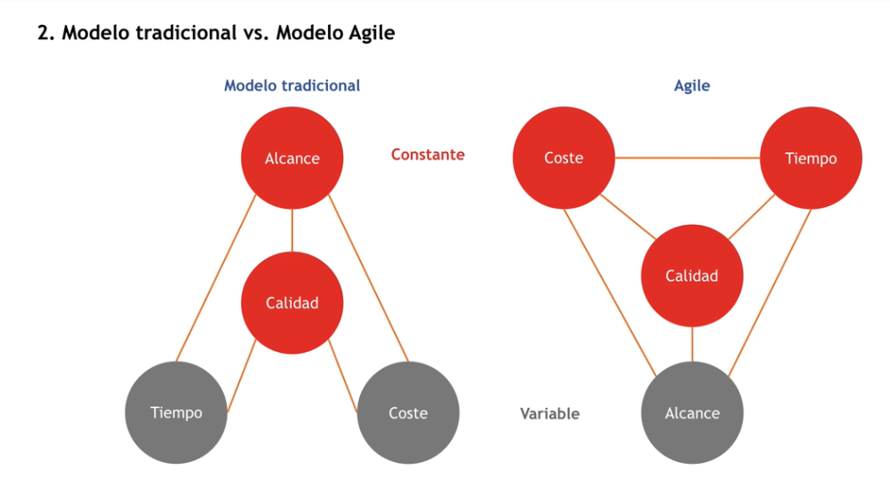
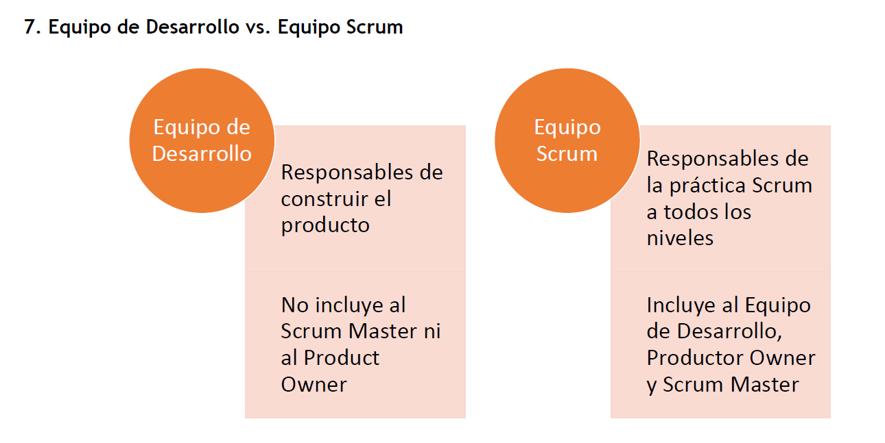
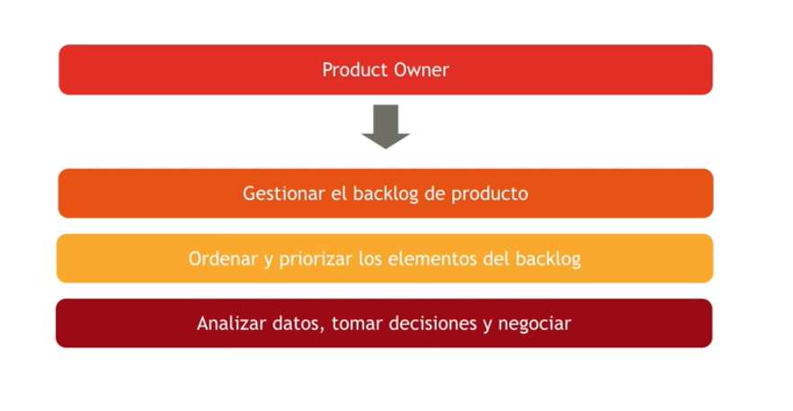
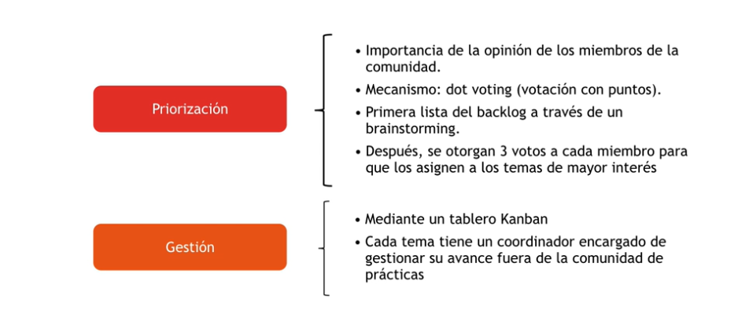

# Módulo 1. Agile y Scrum 

## Unidad 1. Qué es Agile 

### La organización celular

### Qué es agile

#### Objetivos

- Entender por qué las organizaciones buscan aproximaciones ágiles a la ejecución de proyectos.
- Conocer como *Agile* pretende maximizar la entrega de valor al cliente.
- Aprender cuáles son las principales palancas y barreras para el despliegue de *Agile* en las organizaciones.

### Agile, una palanca para el cambio

1. Reduce el time to market. Reduce el tiempo de producción y desplieuge del producto al cliente final . 
2. Disponer de un producto "clientecéntrico". 
3. Reducir los costes. 
4. Mejora de la calidad de trabajo. Se amplía también su definición como la satisfacción del cliente con el producto. 
5. Facilita la aglidad empresarial. Es la capacidad de una empresa a cambiar frente a factores internos y externos. 
6. Mejora continua. 

### 3. Modelo tradicional vs. Modelo ágil

El alcance de un proyecto/un producto es variable, vamos a estar en continua retroalimentación con el cliente para saber si con las prestaciones que tiene el producto es suficiente para satisfacer sus necesidades/deseos. 

### 4. Factores a tener en cuenta para implementar Agile 

1. **Dónde está el valor.** Una mentalidad ágil  está convencida en que el valor está en la experimentación o en la adaptación incremental del producto. Si el producto es estático o la experimentación no tiene valor para la empresa, no puede implementar una metodología ágil. 

2. **Las metodologías ágiles requieren dedicación del negocio.** Tener en cuenta la representatividad real de la voz del cliente, ubicación real del uso y del conocimiento

3. **El valor debe poder ser entregado de manera incremental.**  Tener en cuenta si es real construir y validar incrementalmente. Hay que considerar la independencia real del equipo, y si el ciclo real de realización del valor es compatible con la cadencia del proyecto

### 5. Principales retos para implementar Agile

1. Falta de conocimiento. Sesiones de formación de los roles, tanto antes de la constitución de los equipos, como una vez constituidos. 
2. Falta de apoyo de la dirección. Se debe definir desde el inicio los resultados positivos que va a brindar la metología ágil y debe recibir el debido patrocinio de los mandamás. 
3. Dificultad para expanddirse. Agile con un montón de equipos o con equipos grandes es un caos. Se deben utilizar marcos de escalado como SAFE o LeSS. 
4. Tiempo percibido para la transicióh. No hay que usar enfoques casacada para implementar agile. 

### 6. Cómo empezar

Depende del producto que desarrolles debes seleccionar por dónde empezar. También va en función del riesgo a fracasar. 

### 7. Factores críticos del éxito

- La independencia en la entrega de valor de los equipos involucrados, tanto a nivel de equipo individual como de programa ágil.

- La disponibilidad de los clientes/ stakeholderspara dedicarse al proyecto.

- La capacidad real de entregar el valor de manera incremental.

- Sponsoring adecuado para vencer la resistencia interna, cohesionar a la organización en la iniciativa y lidiar con resistencia de los proveedores externos. 

## 2. Roles

- **Project manager**: No existe. Esto no va de proyectos, sino de crear valor. Por un lado está el producto y por otro lado el alcance. Mientras en una metodología nos dedicamos a gestionar el alcance del proyecto,  Scrum se basa en construir un producto de una manera iterativa e incremental. El foco está en el entregable y en el valor y no en las actividades que llevan a conseguirlo. 

Tenemos 3 roles: 
- Product owner 
- Scrum master 
- Equipo de desarrollo 

### Product owner

- Define las funcionalidades del producto. Producto: elemento de valor que vamos a entregarle al cliente. 
- Decide la fecha y contenido de lanzamiento. 
- Será responsable de la rentabilidad del producto (retorno de inversión).
- Prioriza las características de acuerdo al valor que crean. 
- Ajusta las funcionalidades y su prioridad en cada iteración.
- Acepta o rechaza los resultados. 

### Scrum Master 

- Responsable de la promulgación de los valores y las prácticas de Scrum
- Elimina los obstáculos
- Supervisa/facilita/Ayuda que el equipo es totalmente funcional y productivo. Ojo, no es responsble del equipo. 
- Facilita la colaboración estrecha de los roles y las funciones. (Junto con el product owner, definen qué van a construir, mientras que el equipo de desarrollo definen cómo van a construirlo)
- Protege al equipo de interferencias externas. 

### Equipo de desarrollo 

- Normalmente de 3-9 personas (cantidad de personas que podrían comer 2 pizzas grandes enteras). 
- Multifuncional (contiene todos los roles necesarios)
- Miembros deben estar a tiempo completo
- Los equipos son auto-organizados (incluyendo entrada y salida de miembros)
- Idealmente, no hay títulos/profesiones
- El equipo solo puede cambiar entre Sprints (no durante el sprint)

### 7. Equipo de desarrollo vs. Equipo Scrum

### 8. Qué vs. Cómo

En un modelo tradicional el project manager debe decidir qué y cómo hay que construir el proyecto. 

En Scrum, eso está diferenciado en dos roles. 

El product owner, conoce el negocio, sabe priorizar las funcionalidades y puede estimar el impacto que van a tener en el cliente. No es un técnico ni especialista para desarrollar/construir el producto, él conoce el negocio. Es el equipo de desarrollo quien tiene esa responsabilidad. 

El Scrum Master, vela por las buenas prácticas, resolver los bloqueos/obstáculos que el equipo de Desarrollo se enfrente, y asistir al Product Owner en la búsqueda de la maximización del valor entregado al cliente. 

### Tips

- El equipo de desarrollo puede expulsar a miembros del equipo salvo que produzca un impedimento, donde el Scrum Master tiene que resolverlo. 
- El Analista Funcional no es el Product Owner, el Analista Técnico no es el Product Master. No existen equivalencias en Scrum para estas posiciones. 
- Tareas tales como  aseguramiento de la calidad, la experiencia de usuario, arquitectura empresarial son responsabilidades de todo el equipo de desarrollo.  Son nuevas competencias a añadir además de las competencias necesarias para entregar el mejor producto, y son competencias compartidas en igual medida. 
- El Scrum Master no es el responsable del equipo. Es un coach que ayuda al equipo a tomar las mejores decisiones.
- No obstante, no todas las decisiones están en manos del equipo de desarrollo. Todos los eventos y artefactos Scrum no son opcionales y el equipo aquí no es autónomo. 

## 3. Roles y responsabilidades en un entorno ágil 

### El product owner

- Define las funcionalidades (el qué) del producto
- Decide la fecha del lanzamiento del sprint y/o la versión y el contenido
- Será responsable de la rentabilidad del proceso (ROI).
- Define y prioriza las funcionalidades de acuerdo al valor que aportan al cliente. 
- Ajusta las funcionalidades y su prioridad en cada interacción. 
- Acepta o rechaza los resultados. 

Para tener autoridad sobre algo debo ser responsable del producto. 
Si puedo decidir también tengo accountability. 

#### El product owner y la priorización del backlog 

**¿Qué es el backlog?** --> 

### Priorización del backlog

### 3. El scrum master y el equipo de desarrollo 

### 4. El agile y la mejora continua

Uno de los principios ágiles es buscar la mejora continua. Para ello se deben compartir tanto las buenas como las malas prácticas. 

Dentro de los equipos Scrum, esto puede realizarse tanto en los Daily Scrum como en las Retrospectivas de Sprint, pero ¿cómo se hace entre células organizacionales? --> por medio de Comunidades de Prácticas. 

### 5. Comunidad de prácticas 

Es un grupo de personas que desempeña **el mismo rol o responsabilidad profesional desde la experiencia, no la opinión**, que profundiza en un conocimiento o pericia en un asunto a través de una interacción continuada. 

#### Estructura
- **Moderador**. Se asegura que las actividades se lleven a cabo y promueve la participación de los miembros. 
- **Líder**. Tiene claro hacia donde quiere llevar la comunidad. 
- **Miembros**. Participan activamente, generan ideas, dan feedback. 

#### Cómo funciona una comunidad de prácticas 

Se inicia en una fundación, consiste en una reunión de 2 horas. 

#### Cómo se gestiona y prioriza el backlog en una comunidad de prácticas 

Sin una comunidad de prácticas es imposible escalar una metodología ágil e implementar mejora continua. 

